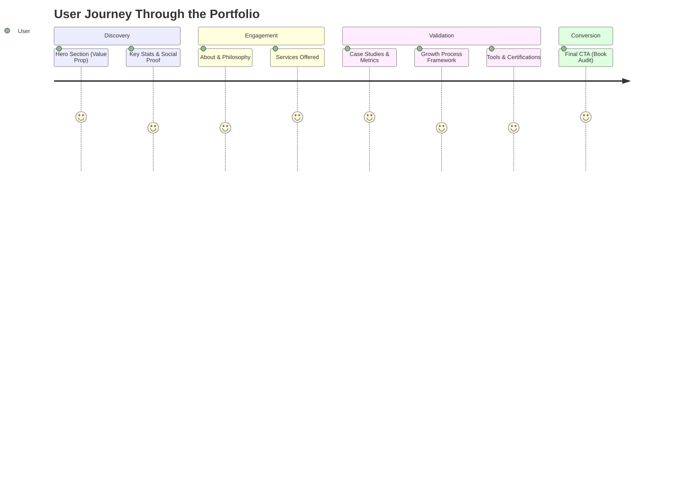
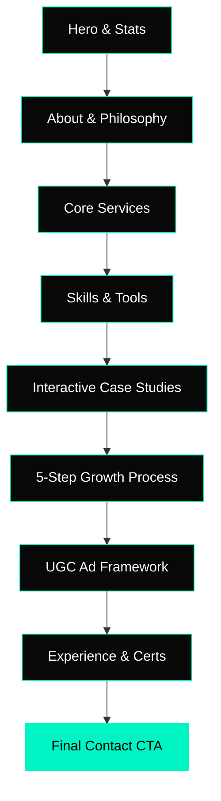
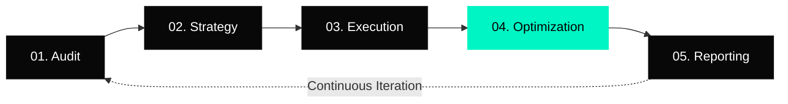

# 🚀 Anshuman Kushwaha | AI-Driven Growth Strategist Portfolio

Welcome to the source code for my professional portfolio. This project is a premium, high-converting single-page application designed to showcase my expertise in Performance Marketing, SEO, Analytics, and AI Automation.

## 🎯 About the Portfolio

This portfolio isn't just a digital resume—it's a demonstration of growth mechanics. Designed with high-end aesthetics (dark theme, glassmorphism, dynamic animations) and structured to follow a proven high-conversion funnel.



## ✨ Core Features

- **Modern Glassmorphism UI**: High-end translucent elements over dynamic particle backgrounds.
- **Scroll Reveal Animations**: Sections fade and slide into view as the user scrolls, creating a guided experience.
- **Interactive Case Studies**: Expandable sections detailing exact metrics, strategies, and psychological insights used to achieve growth.
- **Dynamic Particle Network**: A custom canvas-based interactive background that reacts to cursor movement.

## 🏗️ Architecture & Flow



## 🛠️ Tech Stack
- **HTML5**: Semantic and accessible document structure.
- **Vanilla CSS3**: Custom properties, Flexbox/Grid layouts, keyframe animations, and glassmorphism (no heavy frameworks).
- **Vanilla JavaScript**: Lightweight functionality for custom cursor, particle networking, scroll spies, and intersection observers.

## 🚀 How to Run Locally

Running this portfolio locally is incredibly simple. No complex build tools or dependencies are required.

### Option 1: Live Server (Recommended)
If you use VS Code, the easiest way is to use the **Live Server** extension:
1. Open this repository in VS Code.
2. Locate `index.html`.
3. Right-click and select **"Open with Live Server"**.
4. The portfolio will automatically open in your default browser.

### Option 2: Python HTTP Server
If you have Python installed, you can serve the directory locally via the terminal:
```bash
# Navigate to the project directory
cd Anshuman-Portfolio

# Start the server (Python 3.x)
python -m http.server 8000
```
Open your browser and navigate to `http://localhost:8000`.

### Option 3: Direct File Execution
Since the portfolio relies purely on Vanilla HTML/CSS/JS without external fetches, you can simply double-click the `index.html` file to open it directly in any modern web browser.

## 📈 My Growth Methodology



## 📧 Contact
Interested in building scalable growth systems together? 
[Book a Free Growth Audit](mailto:anshkush9292@gmail.com)
